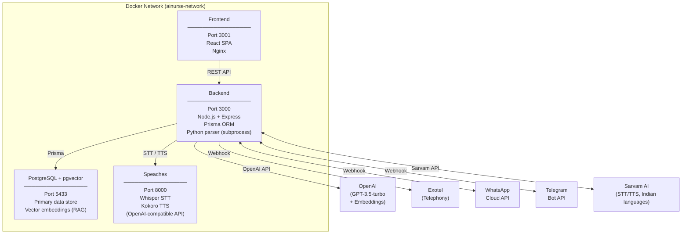

# AI Nurse — System Architecture

## 1. Services Overview

The system runs as four Docker containers on a shared network.



---

## 2. Setup & Admin Flow

This flow covers everything an administrator does before a patient conversation can take place.

```mermaid
%%{init: {'theme': 'dark'}}%%
sequenceDiagram
    actor Admin
    participant Dashboard as Admin Dashboard<br/>(React)
    participant API as Backend API<br/>(Express)
    participant Python as KB Parser<br/>(Python subprocess)
    participant DB as Database<br/>(PostgreSQL)

    %% ── Authentication ──────────────────────────────────────────
    rect rgb(30,50,80)
        note over Admin,DB: Step 1 — Authentication
        Admin->>Dashboard: Log in (email + password)
        Dashboard->>API: POST /v1/api/auth/login
        API-->>Dashboard: JWT token
    end

    %% ── KB Upload ───────────────────────────────────────────────
    rect rgb(20,60,40)
        note over Admin,DB: Step 2 — Upload Knowledge Base (XLSX)
        Admin->>Dashboard: Upload condition XLSX<br/>(e.g. heart_failure.xlsx)
        Dashboard->>API: POST /v1/api/:tenantId/knowledge-graphs/upload
        API->>Python: Spawn parser with file path
        Python-->>API: JSON — phases, symptoms,<br/>red flags, instructions, scoring rules
        API->>DB: Store KnowledgeGraph record<br/>(status = DRAFT, jsonData = parsed content)
        API-->>Dashboard: Validation result<br/>(errors if any)
        Admin->>Dashboard: Review errors, then Activate
        Dashboard->>API: POST /v1/api/:tenantId/knowledge-graphs/:id/activate
        API->>DB: Previous ACTIVE → ARCHIVED<br/>This KB → ACTIVE
        API-->>Dashboard: Activated ✓
    end

    %% ── Patient Import ──────────────────────────────────────────
    rect rgb(60,50,20)
        note over Admin,DB: Step 3 — Create / Import Patients
        Admin->>Dashboard: Import patient CSV<br/>(or create individually)
        Dashboard->>API: POST /v1/api/:tenantId/patients/import
        API->>API: Normalise phone (E.164)<br/>Encrypt name + DOB<br/>Assign condition, classification,<br/>trigger date (surgery / discharge /<br/>enrolment / diagnosis)
        API->>DB: Store Patient records<br/>(linked to tenantId + ACTIVE KB)
        API-->>Dashboard: Import summary (created, skipped, errors)
    end

    %% ── Optional: RAG Documents ─────────────────────────────────
    rect rgb(60,35,15)
        note over Admin,DB: Step 4 (optional) — Upload Clinical Documents for RAG
        Admin->>Dashboard: Upload reference document<br/>(text / markdown / PDF)
        Dashboard->>API: POST /v1/api/:tenantId/documents
        API->>API: Chunk with LangChain splitter<br/>(1 000 tokens, 200 overlap)
        API->>API: Embed each chunk<br/>(OpenAI text-embedding-3-small)
        API->>DB: Store TenantDocument +<br/>DocumentEmbedding rows<br/>(pgvector)
        API-->>Dashboard: Document indexed ✓
    end

    %% ── Channel Config ──────────────────────────────────────────
    rect rgb(45,25,65)
        note over Admin,DB: Step 5 (optional) — Configure Messaging Channels
        Admin->>Dashboard: Enter WhatsApp / Telegram credentials
        Dashboard->>API: POST /v1/api/:tenantId/channels
        API->>DB: Store ProviderConfig<br/>(credentials encrypted at rest)
        API-->>Dashboard: Channel active ✓
    end
```



---

## 3. Conversation Flow

This flow covers what happens from the moment a patient interacts with the system to when results appear on the dashboard. The same clinical engine runs for voice calls, WhatsApp, and Telegram — only the input/output adapters differ.

```mermaid
%%{init: {'theme': 'dark'}}%%
sequenceDiagram
    actor Patient
    participant Channel as Channel<br/>(Exotel / WhatsApp / Telegram)
    participant Orch as Orchestrator<br/>(Call Handler or<br/>Messaging Orchestrator)
    participant KG as Context Loader<br/>(Knowledge Graph)
    participant DB as Database
    participant LLM as OpenAI<br/>(GPT-3.5-turbo)
    participant Speech as Speech Layer<br/>(Sarvam / Whisper + Kokoro)
    participant Dashboard as Admin Dashboard

    %% ── Inbound ─────────────────────────────────────────────────
    rect rgb(30,50,80)
        note over Patient,Dashboard: Step 1 — Inbound interaction
        Patient->>Channel: Call or message
        Channel->>Orch: Webhook (phone number, audio / text)
    end

    %% ── Identity + Context ──────────────────────────────────────
    rect rgb(20,60,40)
        note over Patient,Dashboard: Step 2 — Identity & clinical context
        Orch->>DB: Look up patient by phone number
        DB-->>Orch: Patient record<br/>(condition, classification, trigger date, locale)
        Orch->>KG: loadContext(condition, classification,<br/>daysSinceStart, locale, triggerType)
        KG->>DB: Fetch ACTIVE KnowledgeGraph
        DB-->>KG: KB JSON (phases, symptoms,<br/>red flags, instructions, scoring)
        KG-->>Orch: ClinicalContext<br/>• currentPhase + focus<br/>• filtered symptoms for this phase<br/>• red flags<br/>• care instructions<br/>• system prompt (patient's language)<br/>• track (episodic / chronic)
    end

    %% ── Conversation loop ───────────────────────────────────────
    rect rgb(60,50,20)
        note over Patient,Dashboard: Step 3 — Conversation (repeats each turn)
        Patient->>Channel: Speaks or types
        alt Voice call
            Channel->>Speech: Audio stream
            Speech-->>Orch: Transcript (Whisper or Sarvam STT)
        else WhatsApp / Telegram
            Channel-->>Orch: Text (or voice note → STT)
        end

        Orch->>LLM: Chat completion request<br/>• system: clinical context prompt<br/>• history: prior turns<br/>• user: patient transcript
        LLM-->>Orch: Clinical response text

        Orch->>Orch: Extract clinical events<br/>(symptoms mentioned, red flags triggered)
        Orch->>Orch: Score risk<br/>(base severity + branch shifts → REASSURE / ADVISE / ESCALATE)

        alt Voice call
            Orch->>Speech: Synthesise response (Kokoro or Sarvam TTS)
            Speech-->>Channel: Audio
        else Messaging
            Orch->>Channel: Send formatted text reply
        end

        Orch->>DB: Append turn to transcript<br/>Store ClinicalEvent (symptom, score, patient action)
    end

    %% ── Escalation ──────────────────────────────────────────────
    rect rgb(70,20,20)
        note over Patient,Dashboard: Step 4 — Escalation (if triggered)
        alt Risk score ≥ threshold OR Escalate? = YES on branch
            Orch->>Orch: Determine Patient Action<br/>ER_NOW / FACILITY_TODAY / NURSE_CALLBACK
            Orch->>Channel: Deliver escalation advice to patient<br/>("Go to emergency now" / "Visit clinic today" / "Nurse will call you")
            Orch->>DB: Flag session (requiresEscalation = true,<br/>patientAction, riskScore)
        end
    end

    %% ── Close + Dashboard ───────────────────────────────────────
    rect rgb(45,25,65)
        note over Patient,Dashboard: Step 5 — Session close & dashboard
        Patient->>Channel: Ends call / stops messaging
        Orch->>DB: Close session<br/>(outcome, duration, final risk score)
        Dashboard->>DB: Poll / refresh
        DB-->>Dashboard: Call log, transcript, clinical events,<br/>risk score, patient actions, escalation flags
    end
```



---

## 4. Knowledge Base Structure

A KB is authored in XLSX and contains six sheets. The Python parser validates and converts it to JSON before storage.

| Sheet | Contents |
|-------|----------|
| **Conditions & Phases** | Phase names, day ranges, track (episodic / chronic / hybrid), phase focus |
| **Symptoms** | Symptom list — severity, applicable phases and classifications |
| **Assessment Questions** | Per-symptom branching questions — risk shift, escalate flag, patient action per branch |
| **Red Flags** | Hard triggers — urgency level (Immediate / Urgent / Routine), patient action |
| **Instructions** | Care guidance — category, phase, track, optional threshold patient action |
| **Scoring Logic** | Threshold rules: score ≥ 3 → ESCALATE, 1–2 → ADVISE, ≤ 0 → REASSURE |

### Patient Action values

| Value | Meaning |
|-------|---------|
| `ER_NOW` | Life / limb / sight threatening — go to emergency now |
| `FACILITY_TODAY` | Urgent but not immediately life-threatening — go to clinic today |
| `NURSE_CALLBACK` | Non-urgent — record the symptom, nurse will call back |
| `SELF_MONITOR` | Watch and report at next scheduled check-in |

---

## 5. Multi-Tenancy

Every API route is namespaced by tenant: `/v1/api/:tenantId/...`

- The tenant middleware resolves the tenant from the URL, validates it, and attaches a `TenantContext` to the request using Node's `AsyncLocalStorage`.
- A Prisma middleware layer automatically injects `tenantId` into every database query — services never need to filter manually.
- Each tenant has its own patients, KBs, call logs, documents, and channel credentials. Data never crosses tenant boundaries.

```
Request: /v1/api/rean-foundation/patients
         ↓
Tenant middleware: resolve "rean-foundation" → tenantId UUID
         ↓
AsyncLocalStorage: attach TenantContext for this request
         ↓
Prisma middleware: all queries automatically include WHERE tenantId = <uuid>
         ↓
Service code: writes prisma.patient.findMany({ where: { condition: 'X' } })
Executed as:  prisma.patient.findMany({ where: { condition: 'X', tenantId: <uuid> } })
```

---

## 6. Technology Stack

| Layer | Technology |
|-------|-----------|
| Backend runtime | Node.js 20 + Express + TypeScript |
| Database | PostgreSQL 16 + pgvector extension |
| ORM | Prisma |
| LLM | OpenAI GPT-3.5-turbo |
| Embeddings (RAG) | OpenAI text-embedding-3-small → pgvector |
| Document chunking | LangChain RecursiveCharacterTextSplitter |
| Speech (self-hosted) | Speaches: Whisper STT + Kokoro TTS (OpenAI-compatible) |
| Speech (cloud) | Sarvam AI (optimised for Indian languages) |
| Telephony | Exotel (outbound calls + webhooks) |
| Messaging | WhatsApp Cloud API, Telegram Bot API |
| KB parsing | Python 3 + openpyxl (subprocess) |
| Frontend | React 18 + Vite + ShadCN/UI + TanStack Query |
| Frontend serving | Nginx |
| Container orchestration | Docker Compose |
